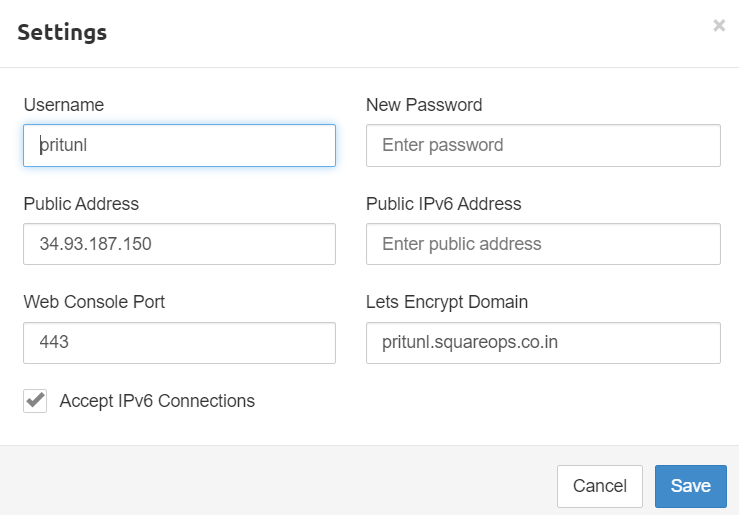
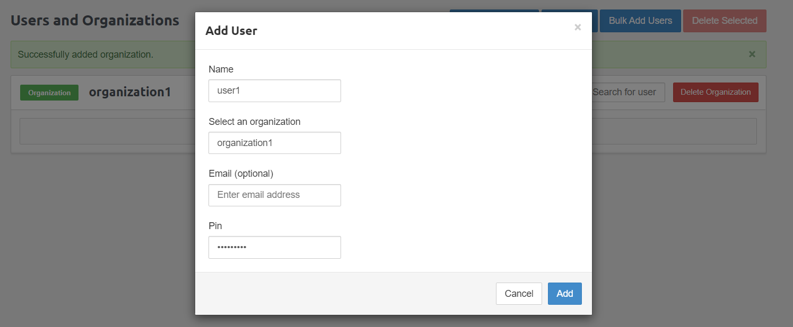

To configure Pritunl VPN:

- On your terminal, run command :
    - **gcloud compute instances get-serial-port-output {vm-name} --zone {vm-zone} | grep 'startup-script' | tail -n 10**
- You will get initial key and user, password for setting up Pritunl.
- Go to the external IP of instance.
- Enter the setup-key received in above step, provide user and password.

- Configure Initial Configuration in the settings.

-To add SSL on Pritunl:

    - Create a DNS record mapping to the vpn-instance public IP.
    - On pritunl setup page, go to settings and add password and port 443 and paste the domain mapped in Lets Encrypt Domain.
    - Pritunl will automatically configure a signed SSL certificate from Lets Encrypt.
    - Access the server on domain name with user and password from initial configuration.

.png)
- Add server, organization and user to pritunl.

- Add server port as 10150 which is already allowed firewall port while creating vpn.

.png)
- Attach organization to the server and Start the server.
- Copy or download user profile link or file.

.png)
- Import the profile in Pritunl client.

.png)
- Set up VPN by connecting to Pritunl client.

.png)
